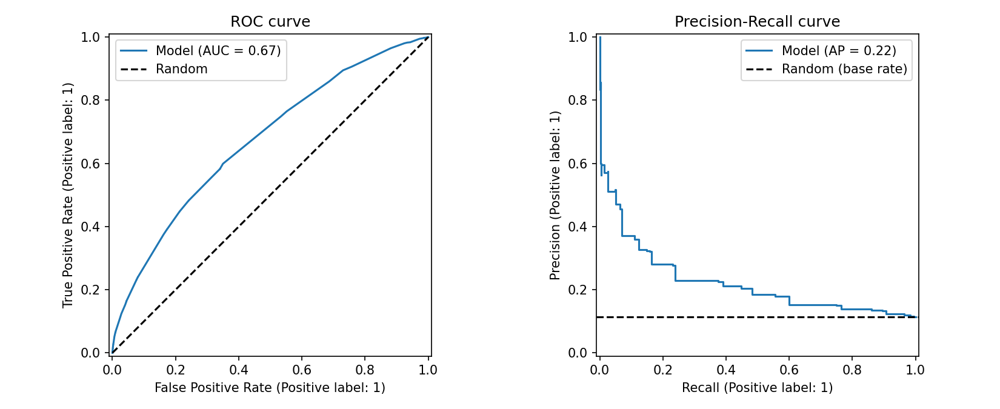
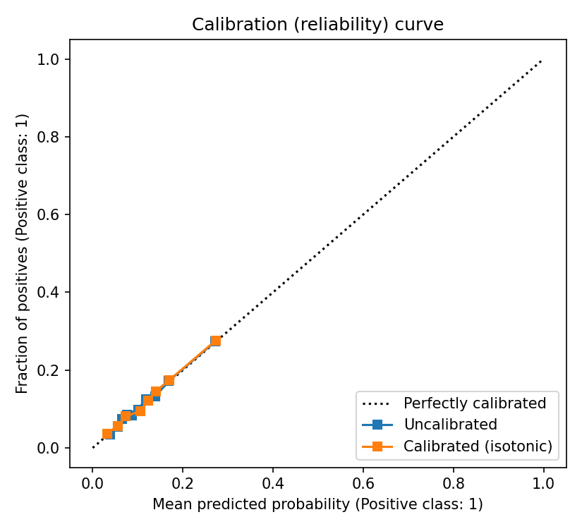
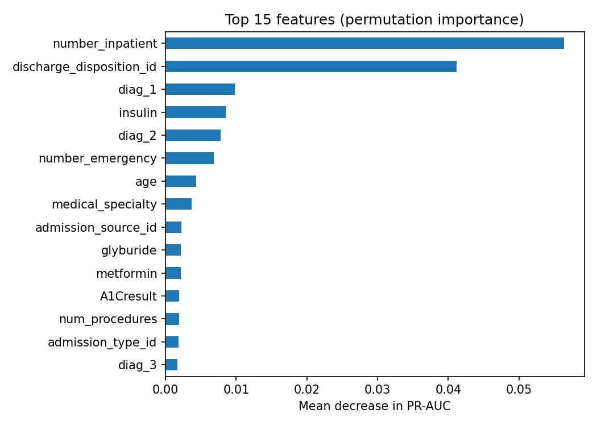

# Hospital Readmission Risk Prediction


Predicting whether a diabetic patient will be **readmitted to hospital within 30 days** of discharge, using 10 years of clinical records from 130 US hospitals.

📓 **Full analysis with outputs:** [`notebooks/readmission_analysis.ipynb`](notebooks/readmission_analysis.ipynb)

The focus of this project is not only model accuracy, but **correct evaluation for a real clinical use case**: no patient-level data leakage, calibrated risk scores, and evaluation under limited follow-up capacity.

## Problem

Early readmissions are costly for hospitals and often a sign of poor care transitions. A hospital can run a follow-up program (phone calls, early visits) for high-risk patients, but it can only contact a limited number of them. The model's job is therefore to **rank patients by risk** and give **reliable probabilities** at discharge time.

## Dataset

[Diabetes 130-US Hospitals for Years 1999–2008](https://archive.ics.uci.edu/dataset/296/diabetes+130-us+hospitals+for+years+1999-2008) (UCI Machine Learning Repository).

- ~100k hospital encounters, ~70k unique patients, 50 columns
- Demographics, admission details, lab tests, diagnoses (ICD-9 codes), 23 diabetes medications
- Target: `readmitted == "<30"` → 1, otherwise 0 (about 11% positives, so the data is imbalanced)

## Key design decisions

| Decision | Why |
|---|---|
| **Split by patient** (`GroupShuffleSplit`, `StratifiedGroupKFold`) | Many patients have several encounters. A random row split puts the same patient in train and test and gives over-optimistic results. |
| **Remove discharges to hospice or death** | These patients cannot be readmitted, so they are misleading negatives. |
| **Keep `"None"` as a category** in lab results | In this dataset `"None"` means "test not performed", which is useful information, not a missing value. |
| **All fitted steps inside one sklearn `Pipeline`** | Imputation, scaling and encoding are learned only on training folds. The saved model takes raw rows as input. |
| **ICD-9 codes grouped into clinical categories** | Reduces ~700 raw codes to ~10 meaningful groups (circulatory, respiratory, diabetes, ...). |
| **No resampling or class weights** | They distort predicted probabilities. Imbalance is handled in evaluation (PR-AUC, capacity analysis) instead. |
| **Calibration check** (isotonic, on separate patients) | Clinicians need probabilities they can trust ("20% risk" should mean 20%). |
| **Capacity-based evaluation** (top 10/20/30% of patients) | Matches how the model would be used in practice, instead of an arbitrary 0.5 threshold. |

## Results

All numbers are on **held-out test patients** (19,773 encounters), never used for training, model selection or calibration.

**Model comparison (5-fold patient-grouped CV on the training set)**

| Model | ROC-AUC | PR-AUC | Brier score |
|---|---|---|---|
| Logistic Regression | 0.660 ± 0.004 | 0.212 ± 0.008 | 0.0972 |
| **HistGradientBoosting** | **0.671 ± 0.004** | **0.230 ± 0.008** | **0.0961** |

**Final model on the test set**

| Metric | Value |
|---|---|
| ROC-AUC | 0.672 |
| PR-AUC | 0.222 (random = base rate 0.114) |
| Brier score | 0.0955 (always predicting base rate: 0.1006) |

**Follow-up program capacity analysis**

| Patients contacted | Precision | Recall | Lift over random |
|---|---|---|---|
| Top 10% | 0.276 | 0.243 | 2.4× |
| Top 20% | 0.224 | 0.394 | 2.0× |
| Top 30% | 0.197 | 0.521 | 1.7× |

**Main findings**

- Contacting the 10% highest-risk patients reaches about a quarter of all readmissions, 2.4× better than random selection.
- The strongest predictors are **previous inpatient admissions** and **discharge destination**, which matches clinical intuition.
- A ROC-AUC around 0.67 is in line with published results on this dataset: many drivers of readmission (social support, medication adherence) are not in the data.
- **Honest checks:** a row-level vs patient-level CV experiment gave almost the same score here, because the features cannot identify individual patients. The model was also already well calibrated (training on the natural class distribution), so isotonic calibration did not change the Brier score. Both steps are kept as part of a correct protocol.



<p float="left">
  
  
</p>

## How to run

```bash
git clone https://github.com/EhsanR47/hospital-readmission-risk.git
cd hospital-readmission-risk
python -m venv .venv && source .venv/bin/activate
pip install -r requirements.txt

# Option 1: step-by-step notebook with outputs
jupyter notebook notebooks/readmission_analysis.ipynb

# Option 2: scripts (same code, same results)
python -m src.data       # download the dataset (UCI, with a GitHub mirror as fallback)
python -m src.train      # cross-validation, model selection, calibration
python -m src.evaluate   # test metrics and figures in reports/

pytest                   # unit tests
```

## Project structure

```
hospital-readmission-risk/
├── notebooks/
│   └── readmission_analysis.ipynb   # full analysis: EDA → modelling → evaluation
├── src/
│   ├── config.py      # paths and experiment settings
│   ├── data.py        # download, cleaning, patient-level split
│   ├── features.py    # feature engineering and preprocessing
│   ├── train.py       # grouped CV, model selection, calibration
│   └── evaluate.py    # test metrics, capacity analysis, figures
├── tests/             # unit tests (run in GitHub Actions)
├── reports/           # metrics and figures
├── data/raw/          # dataset (not tracked by git)
└── models/            # trained models (not tracked by git)
```

## Limitations and next steps

- The data is from 1999–2008 and uses ICD-9 codes; current hospitals use ICD-10, so the model would need retraining on recent data.
- The dataset includes `race`. Before any real use, the model should be checked for **fairness** (performance per subgroup), and the feature may need to be removed.
- Only information available at discharge is used, but a real deployment would also need a check for data drift over time.
- Possible improvements: hyperparameter search, SHAP explanations per patient, temporal validation.

## Tech stack

Python, pandas, NumPy, scikit-learn, matplotlib, Jupyter, pytest, GitHub Actions
